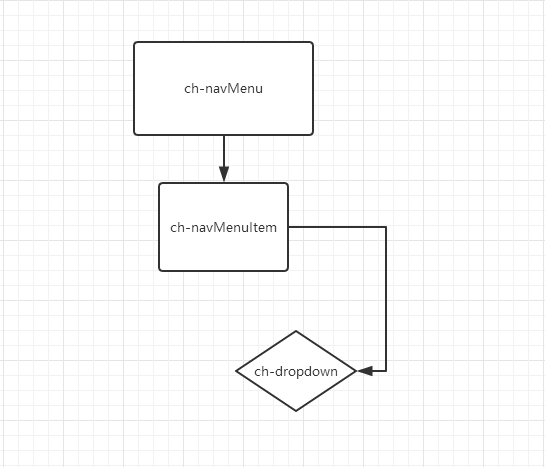

# chrysalis-ng(navMenu) 
[预览效果][1]

# 结构图


# ch-navMenu
`import { ChNavMenuModule } from 'chrysalis-ng';`
## Directives
`Selector: ch-navMenu`
## 说明API

| Name | Description |
| ------ | ------ |
| @Input() title | 'string'  logo 标题文字 |
| @Input() menubarList | 'Array' 菜单内容 |


## 知识点

### Renderer2
> `Renderer2`服务 渲染器，让我们更好的操作DOM；如`addClass`、`removeClass`等，具体可参考[官方API][2]

### ElementRef
> `ElementRef`通过`ElementRef`方便获取到Dom元素；

### HostListener
> `@HostListener`属性装饰器，用来为宿主元素添加事件监听；
```typescript
//document:click || mousedown || mouseup 
@HostListener('click', ['$event.target'])
onClikc(){
    ...
}
```

### ngRx/store
> `Angular`中的状态管理，这里只是通过它来实现侧边栏的'缩放',具体暂不叙述，后面会专门用ngRx/store编写一个实战例子；

 
## 实现:
```
这里主要说一下dropdown这个指令；比较简单的指令，只是给DOM元素add和remove Class元素；
通过`HostListener`装饰器给宿主元素添加`document:click`or`click`事件监听;
在用`active`的值来判断是addClass或removerClass；elementRef获取DOM元素;
Renderer2服务中的addClass和removerClass渲染Dom元素
```

### ch-navMenu.html
```html
<div class="ch-menu">
  <a class="ch-logo">{{title}}</a>
  <a class="ch-collapse fa  fa-align-justify" (click)="changeCollapse()"></a>
  <div class="user-profile">
    <ch-navMenuItem [menubarList]="menubarList"></ch-navMenuItem>
  </div>
</div>
```

### ch-navMenu.ts
```typescript
import { Component, Input } from '@angular/core';
import { Store } from '@ngrx/store';
import { chrysalisConfig } from '../chrysalis-config';
@Component({
  selector: 'ch-navMenu',
  templateUrl: './ch-navMenu.component.html',
  styleUrls: ['./ch-navMenu.component.scss']
})
export class ChNavMenuComponent {
  @Input() menubarList = [];
  @Input() title: string;
  isColl: boolean;
  sidebarColl: any;
  constructor(private chryConfig: chrysalisConfig, private Store: Store<any>) { }

  changeCollapse() {
    const unSub = this.Store.select('sidebar').subscribe(data => {
      this.isColl = Boolean(data);
    });
    this.isColl ? this.Store.dispatch({ type: this.chryConfig.COLLAPSED }) : this.Store.dispatch({ type: this.chryConfig.NORMAL });
    unSub.unsubscribe();
  }
}
```
### ch-navMenuItem.html
```html
<ul class="ch-bar">
  <ng-container *ngFor="let menu of menubarList">
        <li class="ch-dropdown-menu" *ngIf="menu.template" chDropdown>

            <a *ngIf="!menu.downChild && menu.router" class="ch-menu-titel" [routerLink]="menu.router">
              <i *ngIf="menu.icon" class="fa {{menu.icon}}"></i>
              <ng-template
                  [ngTemplateOutlet]="menu.template" 
                  [ngOutletContext]="{ menu: menu }">
              </ng-template>
            </a>

            <a *ngIf="!menu.downChild && menu.url" class="ch-menu-titel" [href]="menu.url">
              <i *ngIf="menu.icon" class="fa {{menu.icon}}"></i>
              <ng-template
                  [ngTemplateOutlet]="menu.template" 
                  [ngOutletContext]="{ menu: menu }">
              </ng-template>
            </a>

            <a *ngIf="menu.downChild" class="ch-menu-titel">
              <i *ngIf="menu.icon" class="fa {{menu.icon}}"></i>
              <ng-template
                  [ngTemplateOutlet]="menu.template" 
                  [ngOutletContext]="{ menu: menu }">
              </ng-template>
             
              <div *ngIf="menu.downChild" class="ch-dropdown-toggle">
                <ul>
                  <div class="dropTitle">收到 {{menu.template._parentView.component.num}} 条消息通知</div>
                  <li *ngFor="let down of menu.downChild" [routerLink]="menu.router">
                    <a>{{down.title}}</a>
                  </li>
                  <div class="dropfoot">查看全部消息通知 <i class="fa fa-comment pull-right"></i></div>
                </ul>
              </div>
            </a>
        </li>
        <ng-container *ngIf="menu.options">
          <li class="ch-dropdown-menu" chDropdown>
            <a class="ch-menu-titel"><i *ngIf="menu.icon" class="fa {{menu.icon}}"></i>{{menu.title}}</a>
            <div class="ch-dropdown-toggle" #dropdownMenu>
                <ul>
                  <li *ngFor="let option of menu.options">
                    <a *ngIf="option.router" [routerLink]="option.router">{{option.text}}</a>
                    <a *ngIf="!option.router">{{option.text}}</a>
                  </li>
                </ul>
            </div>
          </li>
        </ng-container>
  </ng-container>
</ul>
```

### ch-navMenuItem.ts
```typescript
import { Component, Input } from '@angular/core';
@Component({
  selector: 'ch-navMenuItem',
  templateUrl: './navMenuItem.component.html',
  styleUrls: ['./navMenuItem.component.scss']
})
export class NavMenuItemComponent {
  @Input() menubarList: any[];
  constructor() { };
}
```
### ch-Dropdown.ts
```typescript
import { Directive, Renderer2, HostListener, ElementRef } from '@angular/core';

@Directive({
  selector: '[chDropdown]'
})
export class DropdownDirective {
  active = false;
  stateCss = 'open';
  constructor(private renderer: Renderer2, private elementRef: ElementRef) { }

  @HostListener('document:click', ['$event'])
  onDocHostClick($event) {
    const isContains = this.elementRef.nativeElement.contains($event.target);
    if (!isContains) {
      this.active = false;
      this.changeHostState();
    }
  }

  @HostListener('click', ['$event'])
  onHostClick() {
   this.toggleClass();
  }

  toggleClass() {
    this.active = !this.active;
    this.changeHostState();
  }

  changeHostState() {
    if (this.active) {
      this.renderer.addClass(this.elementRef.nativeElement, this.stateCss);
      return;
    }
    this.renderer.removeClass(this.elementRef.nativeElement, this.stateCss);
  }
  
}
```
  [1]: https://zchanges.github.io/chrysalis-ng/#/component/NavMenu
  [2]: https://angular.io/api/core/Renderer2
