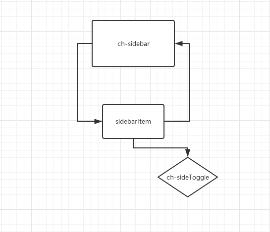

# chrysalis-ng(sildebar) 
[预览效果][1]

# 结构图


# ch-navMenu
`import { ChSidebarModule } from 'chrysalis-ng';`
## Directives
`Selector: ch-sidebar`
## 说明API
**ch-sidebar**

| Name | Description |
| ------ | ------ |
| @Input() menuList | 'Array'  菜单数组 |
| @Input() isFixed | 'boolean' 默认true class样式是否固定侧边栏 |

**sidebarItem**

| Name | Description |
| ------ | ------ |
| @Input() menuList | 'Array'  菜单数组 |
| @Output() toggleCollapse | 'boolean' 默认true |


## 知识点
> 涉及的知识点其他组件都有讲解；主要有`HostListener` `@ngrx/store` 

 
## 实现:
```
这里需要注意的是子组件sidebarItem调用了父组件。必须用条件阻止无限循环`*ngIf="menuItem.children"`

侧边栏的缩放还是通过`ngRx/stroe`来实现，因为侧边栏缩放状态不仅仅一个组件对他进行管理控制，所以采用`ngRx/stroe`；

sideToggle指令用来实现二级菜单显示隐藏的，之前是通过JQ的slideToggle来实现的，现在通过angular的elementRef来操作DOM，在用css3的transition来控制hight来实现的slideToggle的效果，完全抛弃JQ；
在过程中获取Dom的height比较麻烦，是用过判断elementRef的`child.childNodes`来查看有几个为SIDEBARITEM的标签来动态获取高度，其代码也比较蹩脚；后面会进一步优化代码；
```
### ch-sidebar.html
```html
<div class="ch-leftMenu" [ngClass]="{barFixed: isFixed}">
    <ul class="ch-navMenu" [ngClass]="{'menu-collapsed': !(isCollapse | async)}">
        <sidebarItem [menuItem]="item" (toggleCollapse)="onToggleCollapse($event)"  *ngFor="let item of menuList"></sidebarItem>
    </ul>
</div>
```
### ch-sidebar.ts
```typescript
import { Component, OnInit, HostListener, Input } from '@angular/core';
import { Store } from '@ngrx/store';
import { chrysalisConfig } from '../chrysalis-config';
import { Observable } from 'rxjs/Rx';
import { Subject } from 'rxjs/Subject';
import 'rxjs/add/operator/throttleTime';


@Component({
  selector: 'ch-sidebar',
  templateUrl: './ch-sidebar.component.html',
  styleUrls: ['./ch-sidebar.component.scss']
})
export class ChSidebarComponent implements OnInit {

  @Input() menuList: any[];
  @Input() isFixed = true;
  isCollapse: any;
  lockState = true;
  resizeSub: Subject<any> = new Subject<any>();

  constructor(private chryConfig: chrysalisConfig, private Store: Store<any>) { }

  @HostListener('window:resize')
  onwindwoResize(): void {
    if (this.lockState) {
      this.resizeSub.next();
    } else {
      if (!this.isSidebarCollapse()) {
        this.lockState = true;
      }
    }
  }

  ngOnInit() {
    this.sidebarCollapse();
    this.isCollapse = this.Store.select('sidebar');
    this.resizeSub.throttleTime(200).subscribe(() => {
      this.sidebarCollapse();
    });
  }

  private sidebarCollapse() {
    window.innerWidth <= this.chryConfig.layoutSize.widthCollapseSidebar ? this.Store.dispatch({ type: this.chryConfig.COLLAPSED }) : this.Store.dispatch({ type: this.chryConfig.NORMAL });
  }

  private isSidebarCollapse() {
    return window.innerWidth <= this.chryConfig.layoutSize.widthCollapseSidebar;
  }

  onToggleCollapse(event) {
    this.lockState = event;
  }
}
```
### sidebarItem.html
```html
<li  chSlideToggle>
    <a *ngIf="menuItem.children" class="ch-sidebar-list-link ch-sidebar-parent" (click)="onToggleSub($event)" routerLinkActive="active">
          <i class="{{menuItem.icon}} sid-parent-i"></i>
          <span class="sid-parent-span">{{menuItem.title}}</span>
          <b class="fa fa-angle-down sid-parent-b"></b>
    </a>

    <a *ngIf="!menuItem.children" class="ch-sidebar-list-link" [routerLink]="menuItem.route"  routerLinkActive="active">
          <i class="{{menuItem.icon}}"></i>
          <span>{{menuItem.title}}</span>
    </a>

    <ul *ngIf="menuItem.children" class="sidebar-childlist">
        <sidebarItem [menuItem]="subItem" *ngFor="let subItem of menuItem.children"></sidebarItem>
    </ul>
</li>

```
### sidebarItem.ts
```typescript
import { Component, Input, EventEmitter, Output } from '@angular/core';
import { Store } from '@ngrx/store';
import { chrysalisConfig } from '../../../chrysalis-config';


@Component({
  selector: 'sidebarItem',
  templateUrl: './sidebarItem.component.html',
  styleUrls: ['./sidebarItem.component.scss']
})
export class SidebarItemComponent {
  arrows = false;
  @Input() menuItem: any;
  @Output() toggleCollapse = new EventEmitter<any>();
  constructor(private chryConfig: chrysalisConfig, private Store: Store<any>) { }

  onToggleSub(event) {
    if (this.sidebarCollapse()) {
      this.Store.dispatch({ type: this.chryConfig.NORMAL });
      this.toggleCollapse.emit(false);
    }
  }

  private sidebarCollapse() {
    return window.innerWidth <= this.chryConfig.layoutSize.widthCollapseSidebar;
  }
}
```
### chSlideToggle.directive.ts
```typescript
import { element } from 'protractor';
import { Directive, HostListener, ElementRef, Renderer2 } from '@angular/core';

@Directive({
  selector: '[chSlideToggle]'
})
export class ChSlideToggleDirective {
  active = false;
  state = 'overturnSub';
  index = 0;
  constructor(private elementRef: ElementRef, private renderer: Renderer2) { }

  @HostListener('click', ['$event'])
  onHostClick($event) {
    const isContainsParent = $event.target.contains(this.elementRef.nativeElement.querySelector('.ch-sidebar-parent'));
    const isContainsI = $event.target.contains(this.elementRef.nativeElement.querySelector('.sid-parent-i'));
    const isContainsSpan = $event.target.contains(this.elementRef.nativeElement.querySelector('.sid-parent-span'));
    const isContainsB = $event.target.contains(this.elementRef.nativeElement.querySelector('.sid-parent-b'));
    if (isContainsParent || isContainsI || isContainsSpan || isContainsB) {
      this.active = !this.active;
      this.getHeight();
      this.toggle();
    }
  }

  getHeight() {
    this.index = 0;
    const child = this.elementRef.nativeElement.querySelector('.sidebar-childlist');
    const array = child.childNodes;
    array.forEach(element => {
      if (element.nodeName === 'SIDEBARITEM') {
        this.index = this.index + 1;
      }
    });
  }

  toggle() {
    if (this.active) {
      this.renderer.addClass(this.elementRef.nativeElement, this.state);
      this.renderer.setStyle(this.elementRef.nativeElement.querySelector('.sidebar-childlist'), 'height', (this.index * 42) + 'px');
      return;
    }
    this.renderer.removeClass(this.elementRef.nativeElement, this.state);
    this.renderer.removeStyle(this.elementRef.nativeElement.querySelector('.sidebar-childlist'), 'height');
  }
}

```


  [1]: https://zchanges.github.io/chrysalis-ng/#/component/Sidebar