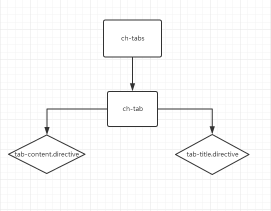

# chrysalis-ng(tabs) 
[预览效果][1]

# 思维导图


# ch-tabs
`import { ChTabsModule } from 'chrysalis-ng';`

## Directives
`Selector: ch-tabs`
`Selector: ch-tab`

## 说明API
**ch-tab:**

| Name | Description |
| ------ | ------ |
| @Input() id | 匹配选中tab页状态值 (any) |
| @Input() title | tab标题 (string) |
| @Input() disabled | 是否可切换tab页 (boolean) 默认值:false|
| @ContentChild() contentTpl | 获取视图中的匹配元素；如directive中的templateRef|
| @ContentChild() titleTpl | 获取视图中的匹配元素；如directive中的templateRef|

## 知识点
> 以标签形式`<></>`为`ContentChildren`； 在组件以内容或组件的一部分为`ViewChildren`
  `ContentChildren`是通过内容投射获取匹配元素的；`ViewChildren`是从模板视图中获取匹配元素的

> ng-content: `ng-content`和ng1中的`ng-transclude`一致；通过内容投射方式，嵌入模板代码。
### @ContentChild()
> `@ContentChild()` 属性装饰器，通过内容投射方式(content Projection)的视图中获取匹配的元素
```typescript
//child
import { Component } from '@angular/core';
@Component({
    selector: 'app-child',
    template: `
      <p>Child Component</p>  
    `
})
export class ChildComponent {
    name: string = 'app-child';
}

//app-contentChild
import { Component, ContentChild, AfterContentInit } from '@angular/core';
import { ChildComponent } from './../child/child.component';
@Component({
  selector: 'app-contentChild',
  template: `
  <p> contentChild works! <ng-content></ng-content> </p>
  `
})
export class ContentChildComponent implements AfterContentInit {
  @ContentChild(ChildComponent)
  child: ChildComponent;
  ngAfterContentInit() {
    console.dir(this.child); //ChildComponent { name: 'app-child' }
  }
}
```

### @ContentChildren()
> @ContentChildren()属性装饰器，通过内容投射方式(content Projection)的视图中获取匹配多个元素，返回一个`QueryList`集合
```typescript
import { Component,AfterContentInit, ContentChildren,QueryList } from '@angular/core';
import { ChildComponent } from './../child/child.component';

@Component({
  selector: 'app-contentChild',
  templateUrl: './contentChild.component.html',
  styleUrls: ['./contentChild.component.css']
})
export class ContentChildComponent implements AfterContentInit {
  @ContentChildren(ChildComponent)
  childDren: QueryList<ChildComponent>;

  ngAfterContentInit() {
    console.dir(this.childDren);
    //QueryList{_results:Array(2)[ChildComponent][ChildComponent]}
  }
}
```
### ng-template

> `ng-template`:用来定义模板，如果不进行处理，不会生成DOM
```html
//不显示
<ng-template>
   template
</ng-template>

//显示
<ng-template [ngIf]="true">
   template
</ng-template>
```
### ng-container
> `ng-container`:逻辑容器，不会生成有额外的DOM节点，可用于避免添加额外的元素来使用结构指令；如：`<ng-container *ngFor='let item of list'>`
```html
//ng-template采用[ngIf]="true";风格不统一；可以采用ng-container
<ng-container *ngIf="true">
    In template, no attributes.
</ng-container>
```

### ngTemplateOutlet
> `NgTemplateOutlet `:指令是基于`TemplateRef`已有的对象，插入对应的内嵌视图
```typescript
<ng-template #temp>Hello</ng-template>
<ng-container *ngTemplateOutlet="temp"></ng-container>
```

### TemplateRef
> `TemplateRef`可以创建内嵌视图（Embedded view），也可以轻松访问`NativeElement`;
`ViewContainerRef`是个视图容器可以创建多个视图，可以基于`TemplateRef` 实例创建内嵌视图，指定插入位置，**主要是用来创建和管理内嵌视图和组件视图；**

> `TemplateRef`:实例用于表示内嵌模板对象。

## 实现:
 **问题：**
```
**如何获取需要展现的tab页:
   获取需要展现的tab页就可以通过`ngTemplateOutlet`来插入视图，
   而`ngTemplateOutlet`可以通过`TemplateRef`来插入视图，这样就可以显示tab页。
```   
```
**整体思路:
  1.`ch-tabs`通过`@ContentChildren`装饰器获取到子组件`ch-tab`中的为QueryList集合的tabs(属性)，遍历处理、插入视图;
  2.`ch-tab`中通过`@Input()`传入id、title、disabled等属性，`title`可以直接通过直接传入也可以通过`ng-template`嵌入,并通`过@ContentChild()`装饰器获取到directive中templateRef投影嵌入视图；
  3.`tab-content`&&`tab-title`创建directive，基于ng-tempalte;注入TemplateRef；以便ch-tab获取到`TemplateRef`实例；
```   

   
### ch-tabs.html
```html
<ul class="ch-tabs">  
    <li *ngFor="let tab of tabs" [ngClass]="{active: tab.id == activeTab}" [class.disabled]="tab.disabled==='true'" (click)="onSelect(tab.id)">
      <a>
        <ng-container *ngIf="!tab.title" [ngTemplateOutlet]="tab.titleTpl?.templateRef"> </ng-container>
        <span *ngIf="tab.title">{{tab.title}}</span>
      </a>  
    </li>  
</ul>  
<div class="tab-content">   
  <ng-container *ngFor="let tab of tabs">
    <div class="tab-pane active" *ngIf="tab.id == activeTab">  
       <ng-template [ngTemplateOutlet]="tab?.contentTpl?.templateRef"> </ng-template>
    </div> 
  </ng-container>
</div> 
```
### ch-tabs.ts
```typescript
import { Component, QueryList, ContentChildren, AfterContentInit } from '@angular/core';
import { ChTabComponent } from './tab.component';

@Component({
  selector: 'ch-tabs',
  templateUrl: './ch-tabs.component.html',
  styleUrls: ['./ch-tabs.component.scss']
})
export class ChTabsComponent implements AfterContentInit {
  activeTab: string;
  @ContentChildren(ChTabComponent) tabs: QueryList<ChTabComponent>;
  constructor() { }
  ngAfterContentInit() {
    this.activeTab = this.tabs.first.id;
  }
  
  onSelect(id: string) {
    const tab = this.tabs.find(item => item.id === id);
    if (tab && !(tab.disabled === 'true')) {
      this.activeTab = id;
    }
  }
}
```
### cb-tab.ts
```typescript
import { Component, Input, ContentChild } from '@angular/core';
import { TabContentDirective } from './tab-content.directive';
import { TabTitleDirective } from './tab-title.directive';
@Component({
  selector: 'ch-tab',
  template: ''
})
export class ChTabComponent {
  @Input() id: string;
  @Input() title: string;
  @Input() disabled: boolean | string = false;
  @ContentChild(TabContentDirective) contentTpl: TabContentDirective;
  @ContentChild(TabTitleDirective) titleTpl: TabTitleDirective;
  constructor() {}
}
```
### tab-title && tab-content
```typescript
//tab-title
import { Directive, TemplateRef } from '@angular/core';
@Directive({
  selector: '[ng-template[chTabTitle]]'
})
export class TabTitleDirective {
  constructor(private templateRef: TemplateRef<any>) { }
}

//tab-content
import { Directive, TemplateRef } from '@angular/core';
@Directive({
  selector: '[ng-template[chTabContent]]'
})
export class TabContentDirective {
  constructor(private templateRef: TemplateRef<any>) { }
}

```
## 遇到的坑
> 如何判断`"false"`值等于`false`

1.`eval('false')` 
2.`'false' === 'true'`作为字符串去判断

    
  [1]: https://zchanges.github.io/chrysalis-ng/#/component/Tabs